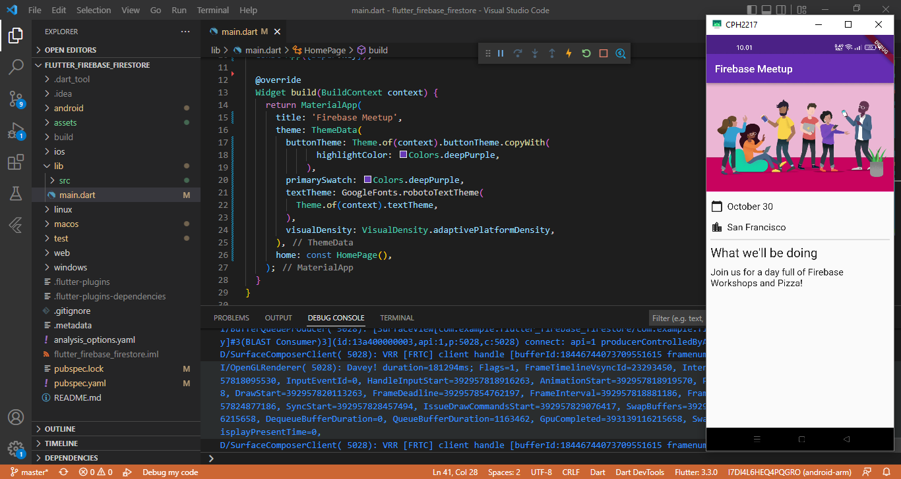
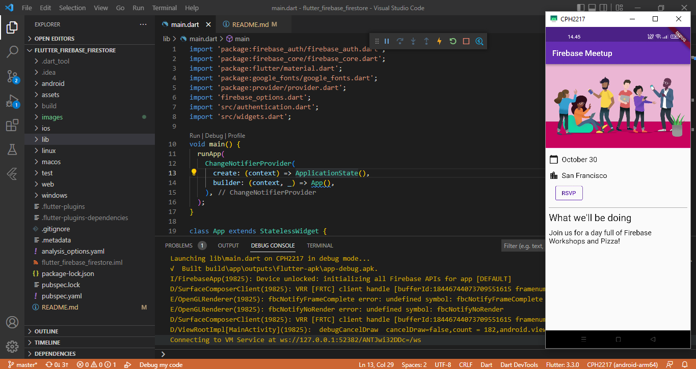
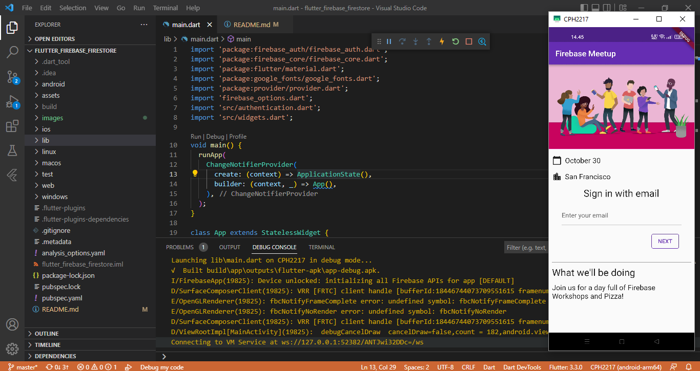
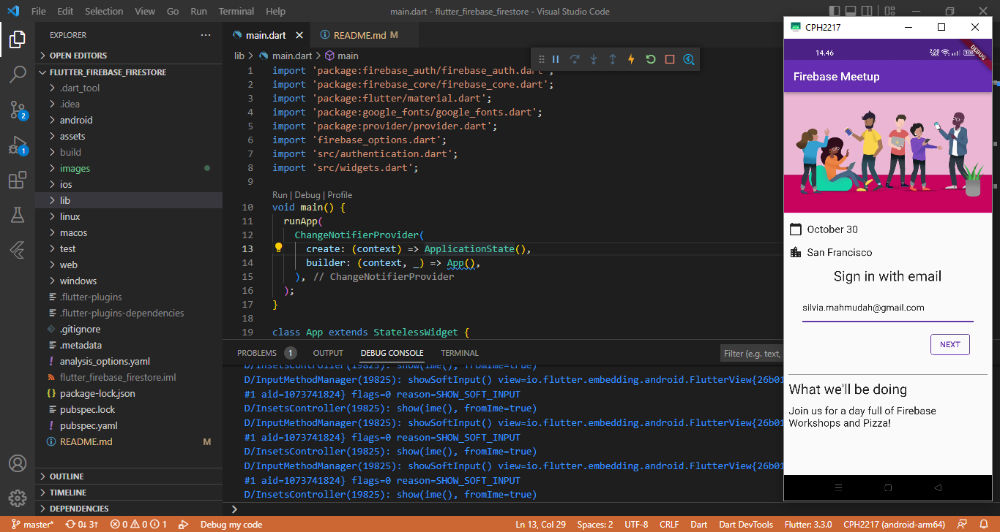
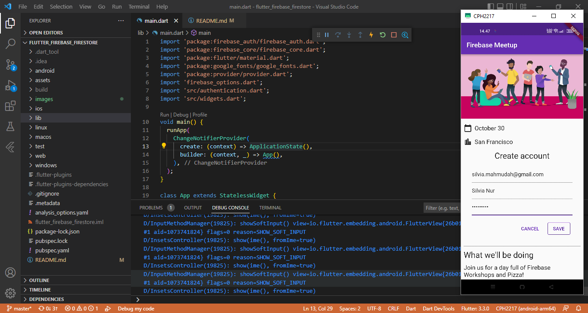
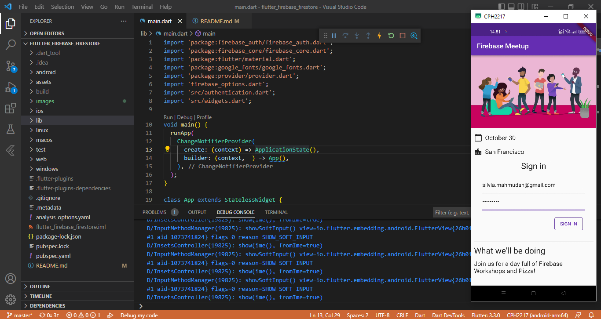
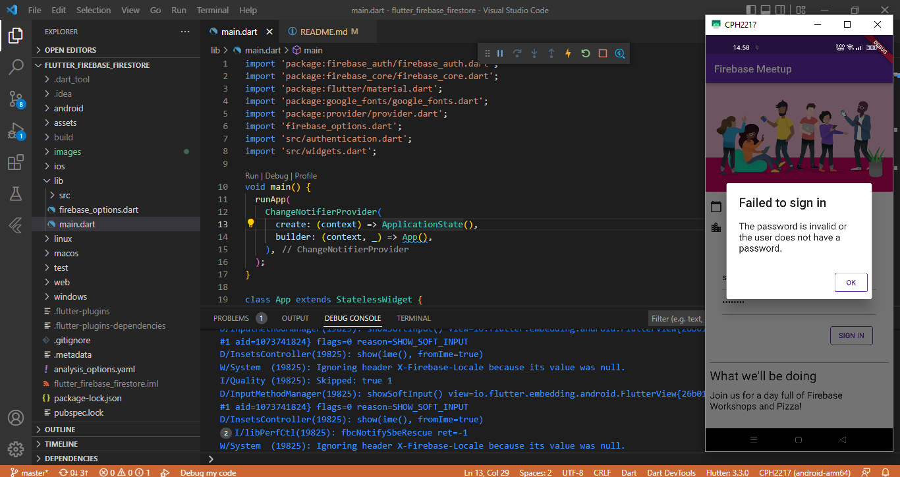
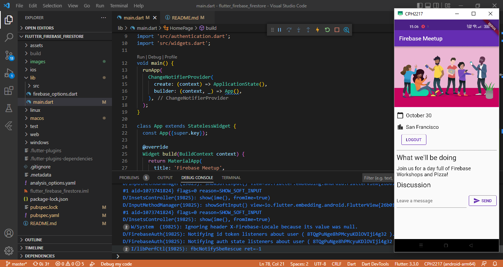
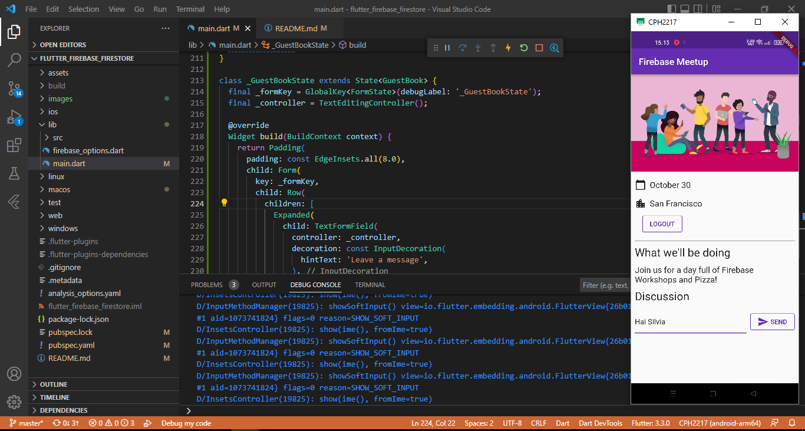

# flutter_firebase_firestore

SILVIA NUR MAHMUDAH

## Getting Started

### Mendapatkan kode sampel

### Menambahkan login pengguna (RSVP)
Berikut adalah awal dari alur otentikasi, di mana pengguna dapat menekan tombol RSVP, untuk memulai formulir email.

Setelah memasukkan email, sistem mengkonfirmasi jika pengguna sudah terdaftar.

Jika pengguna tidak terdaftar, maka akan pergi melalui formulir pendaftaran.

Jika pengguna terdaftar, akan melihat kata sandi sebagai gantinya.

Apabila memasukkan password yang salah penanganan error akan terlihat pada halaman ini.

Setelah pengguna masuk, Anda akan melihat pengalaman masuk yang menawarkan pengguna kemampuan untuk keluar lagi.

### Tulis pesan ke cloud firestore

